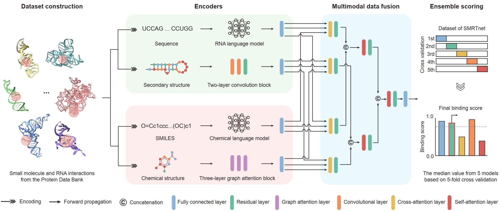
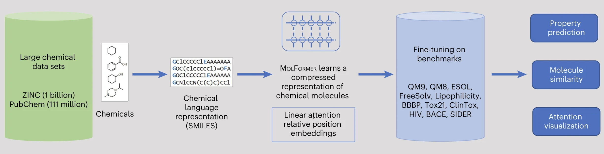

# :sparkles: SMRTnet :sparkles: 

This is a [PyTorch](https://pytorch.org/) implementation of our study:

## :dart: Predicting <ins>s</ins>mall <ins>m</ins>olecule and <ins>R</ins>NA <ins>t</ins>arget interactions using deep neural <ins>net</ins>works

<p align="justify" >
Small molecules can bind RNAs to regulate their fate and functions, providing promising opportunities for treating human diseases. However, current tools for predicting small molecule-RNA interactions (SRIs) require prior knowledge of RNA tertiary structures, limiting their utility in drug discovery. Here, we present SMRTnet, a deep learning method to predict SRIs based on RNA secondary structure. By integrating <b>two large language models</b>, <b>convolutional neural networks</b>, <b>graph attention networks</b>, and <b>multimodal data fusion</b>, SMRTnet achieves high performance across multiple experimental benchmarks, substantially outperforming existing state-of-the-art tools. 
</p>
<p align="justify" >
For wet-lab validation, we conducted a large-scale experimental assessment on SMRTnet predictions for 10 disease-associated RNA targets (including <b>mRNA of undruggable proteins, onco-miRNAs, viral RNAs, and RNA repeat expansions</b>), identifying 40 hits of RNA-targeting small molecules with nanomolar-to-micromolar dissociation constants using microscale thermophoresis (MST). Focusing on the <i>MYC</i> internal ribosome entry site (IRES) as a target, SMRTnet-predicted small molecules showed binding scores correlated closely with observed validation rates. Notably, one predicted compound downregulated <i>MYC</i> expression, inhibited proliferation, and promoted apoptosis in three cancer cell lines. 
</p>
<p align="justify" >
Taken together, SMRTnet expands the scope of feasible RNA targets and accelerates the discovery and development of RNA-targeting therapeutics.
</p>

<p align="center"></p>
<p align="center" > <b>Overview of SMRTnet</b> </p>

## :round_pushpin: Cite us
<!--If you found this package useful, please cite [our paper](xxx)-->
If you use this tool in your research, we kindly ask that you cite our paper (currently under revision): 
```
Fei Y, Wang P, Zhang J, Shan X, Cai Z, Ma J, Wang Y, and Zhang Q C,

Predicting small molecule and RNA target interactions using deep neural networks, 2025.
```
<!-- Yuhan Fei, Pengfei Wang, Jiasheng Zhang, Xinyue Shan, Zilin Cai, Jianbo Ma, Yangming Wang, Qiangfeng Cliff Zhang, -->
## :telephone: Contact us
Please contact us if you are interested in our work or potential academic collaborations.
- Dr. Yuhan Fei, School of Life Sciences, Tsinghua University, Posdoc, yuhan_fei@outlook.com  
- Jiasheng Zhang, School of Life Sciences, Tsinghua University, PhD student, zjs21@mails.tsinghua.edu.cn

## :book: Table of contents
- [:one: Getting Started](#getting-started)
  - Install via PyPI
  - Run SMRTnet via Google Colab
- [:two: Download pre-trained models](#download-pre-trained-models-from-zenodo)
- [:three: Repo Structure](#repo-structure)
- [:four: Datasets](#datasets)
- [:five: Usage](#usage)
  - How to train your own model
  - How to test model performance
  - How to perform interence for novel interactions
  - How to benchmark on known interactions
  - How to identify potential binding sites
  - How to extract RNA sequence embeddings
- [:six: Referenced Repos](#referenced-repos)
- [:seven: Copyright and License](#copyright-and-license)
- [:eight: Patent Declaration](#patent-declaration)
- [:nine: Disclaimer](#disclaimer)

<!--  - How to check your input format -->
<!-- - [Example](#example)-->
<!-- - [6. Web Server (Coming soon...)](#web-server) -->

## Getting started

Please run the following command to check your CUDA version before installing SMRTnet:
```bash
nvidia-smi
```
 or 
 ```bash
nvcc --version
```
<!-- Note: All tests were conducted on a **Linux Ubuntu 13.x** operating system with CUDA versions **11.x and 12.x**.  -->

:heavy_exclamation_mark: Note: To install **Torch** and **DGL** versions compatible with your CUDA setup, please refer to the following URLs:  
- Torch: https://pytorch.org/get-started/previous-versions/  
- DGL: https://www.dgl.ai/pages/start.html

### :pushpin: Install via PyPI
**1) The Stable version for installation** (Recommend)
```bash
conda create -n smrtnet python=3.8.10
conda activate smrtnet
pip install torch==2.4.1+cu118 torchvision==0.19.1+cu118 torchaudio==2.4.1 --index-url https://download.pytorch.org/whl/cu118
pip install smrtnet
conda install dglteam/label/th24_cu118::dgl
```
The stable version of SMRTnet environment is also available on Zenodo (https://zenodo.org/records/14970392) for offline installation.  
<!-- **Note:** This installation method will be maintained periodically. -->

**2) The Latest version for installation** 
```bash
conda create -n smrtnet_latest python=3.8.10
conda activate smrtnet_latest
pip install torch torchvision
pip install smrtnet-latest
conda install dglteam/label/th24_cu121::dgl
```
<!-- **Note:** This installation method will undergo frequent iterations. -->

:heavy_exclamation_mark: **Note:** The table now explicitly details these two installation pathways and provides complete, version-specific dependency lists for reference:

| Package | Stable version | Latest version | Remarks |
|---------|----------------|----------------|---------|
|  babel  |     2.17.0     |     2.17.0     | Up to date  |
|charset-normalizer|     3.3.2     |     3.3.2     |  Required  |
|dgllife|     0.3.2    |     0.3.2     |  Up to date  |
|dgl|   2.4.0.th24.cu118  |   2.4.0.th24.cu121    |  Up to date  |
|matplotlib|   3.7.5   |   3.7.5   |  Constrained by dependencies  |
|networkx|    2.8.8    |   3.1    | Constrained by dependencies  |
|huggingface-hub|   0.29.1   |   0.34.4    |  Up to date  |
|notebook|  7.3.2   |  7.3.3  | Constrained by dependencies  |
|numpy|  1.20.3   |  1.24.4  | Constrained by dependencies  |
|pandas|  1.2.4  |  2.0.3    | Constrained by dependencies  |
|prefetch_generator| 1.0.3   |  1.0.3  | Up to date  |
|prettytable|  3.11.0  | 3.11.0  | Constrained by dependencies  |
|pytorch-lightning|  1.1.5   | 2.4.0 | Constrained by dependencies  |
|python|  3.8.10  |  3.8.10 | Required  |
|rdkit|  2022.3.5  | 2022.3.5 | Required |
|scikit-learn|  0.24.2  | 1.3.2 | Constrained by dependencies  |
|scipy|  1.10.1 | 1.10.1  | Constrained by dependencies  |
|seaborn| 0.13.2  |  0.13.2  | Up to date  |
|tensorboard|  2.14.0  |  2.14.0  | Constrained by dependencies |
|tensorboardX|  2.6.2.2   | 2.6.2.2  | Constrained by dependencies |
|torch| 2.4.1+cu118  |  2.4.1  | Constrained by dependencies |
|tqdm|  4.67.1  |  4.67.1 | Up to date |
|transformers|  4.28.1  |  4.28.1  | Required |
|xsmiles|  0.2.2  |  0.2.2  | Up to date  |
- ‘Required’ denotes that SMRTnet requires this specific version of the indicated package for proper operation;   
- ‘Up to date’ indicates that the dependency is at the latest version of the indicated package;   
- ‘Constrained by dependencies’ explains that, although a newer version is available, compatibility with other dependencies limits the update. 


:heavy_exclamation_mark: **Note:** We conducted usability tests of both installation methods with a diverse group of users to validate the setup process. The hardware and software details are listed below:


|     GPUs     | Driver version | CUDA version| Stable version |  Latest version  |
|-------------|----------------|---------------|--------------|-------------|
|     H20 (96G)    |   570.158.01   |     12.8     | :white_check_mark:  | :white_check_mark: |
|  RTX 4090 (24G)  |   570.124.06   |     12.8     | :white_check_mark:  | :white_check_mark: |
|  RTX 4090 (24G)  |     550.135    |     12.4     | :white_check_mark:  | :white_check_mark: |
|  RTX 2080 (11G)  |   535.216.03   |     12.2     | :white_check_mark:  | :white_check_mark: |
|  A100 40G (40G)  |    560.35.03   |     12.6     | :white_check_mark:  | :white_check_mark: |
|  A800 80G (80G)  |   450.248.02   |     11.0     | :white_check_mark:  | :white_check_mark: |


### :pushpin: Run SMRTnet via Google Colab

We have developed an online jupyter-notebook that allows installation-free execution of SMRTnet directly in a web browser via Google Colab. This solution supports both inference and interpretability functionalities while eliminating system-specific installation issues with limited GPU resources. 


- **Step 1:** Please click the followting link: https://drive.google.com/drive/folders/1HQo3o2saY5U9vPqebz4ZdpCVVQXqw0q_?usp=sharing, and copy the shared folder to your own Google Drive by dragging it into your Drive interface:

<p align="center"></p>

<br>

- **Step 2:** Please follow the step-by-step instructions provided in the SMRTnet.ipynb notebook to run SMRTnet directly: https://colab.research.google.com/drive/1pm5ZCD8cFRvPA9RPvtEaCHoU1p5X5v4Y?usp=sharing

<p align="center"></p>

<br>
:bangbang:  If you encounter any issues during the installation process, please feel free to report the problem in the 'Issues module' or contact us directly via email at yuhan_fei@outlook.com or zjs21@mails.tsinghua.edu.cn.


## Download pre-trained models from Zenodo

<p align="center"></p>
<p align="center" > <b>The architecture of SMRTnet</b> </p>

<!--### :bangbang: Download our pre-trained models from zenodo （Required）-->
<p align="justify" >
Since the pre-trained models used in SMRTnet are large, we have uploaded them to Zenodo for direct download. Users are required to download the pre-trained models, including the RNA language model (RNASwan-seq), the chemical language model (MoLFormer), and the SMRTnet model, from the link below and place them in the SMRTnet folder (see the “Repo Structure” section below for details).
</p>

- Pre-trained models used in SMRTnet can be downloaded from Zenodo: https://zenodo.org/records/14715564, and place them into the SMRTnet directory.

<p align="center"></p>  

- Alternatively, we provided the command lines for users to download the pre-trained models:

```bash

#Step 1: Download SMRTnet to your device and ensure that your current working directory is the `SMRTnet` folder:
git clone https://github.com/Yuhan-Fei/SMRTnet.git

# Step 2: Download and unzip the pre-trained chemical language model (MoLFormer)
wget https://zenodo.org/records/14715564/files/LM_Mol.zip
unzip LM_Mol.zip

# Step 3: Download and unzip the pre-trained RNA language model (RNASwan-seq)
wget https://zenodo.org/records/14715564/files/LM_RNA.zip
unzip LM_RNA.zip

# Step 4: Download and unzip the SMRTnet model into the `results` folder within the SMRTnet directory
wget https://zenodo.org/records/14715564/files/SMRTnet_model.zip
unzip SMRTnet_model.zip -d ./results

```

### :speech_balloon: The details of each module in SMRTnet

<details>
   <summary> Click here to view the architecture of the RNA language model (RNASwan-seq) </summary>
   <p align="center"></p>
   <p align="justify" >We developed an RNA language model, RNASwan-seq, for learning RNA sequence representations. RNASwan-seq consisted of 30 transformer encoder blocks with Rotary Positional Embeddings (RoPE). Each block includes a feed-forward layer with a hidden size of 640 and 20 attention heads. During training, a random cropping strategy was applied to extract 1024-nt segments from the full-length RNA sequences in each iteration, and 15% of nucleotide tokens were randomly selected for potential replacement. The model was trained using masked language modeling to recover the original masked tokens using cross-entropy loss</p>
</details>

<details>
   <summary> Click here to view the architecture of the two-layer convolution block  </summary>
   <p align="center"></p>
</details>

<details>
   <summary> Click here to view the architecture of the chemical language model (MoLFormer)  </summary>
   <p align="center"></p>
   Figure adapted from the MoLFormer publication (https://www.nature.com/articles/s42256-022-00580-7). 
</details>

<details>
   <summary> Click here to view the architecture of the three-layer graph attention block </summary>
   <p align="center"></p>
</details>

<details>
   <summary> Click here to view the architecture of the multimodal data fusion block </summary>
   <p align="center"></p>
</details>


## Repo Structure:
After downloading all our data, the repo has the following structure:


```bash
├── LM_Mol (download from zenodo)
|
├── LM_RNA (download from zenodo)
|
├── results
|   └── SMRTNet_model (download from zenodo)
|          └── SMRTnet_cv1.pth
|          └── SMRTnet_cv2.pth
|          └── SMRTnet_cv3.pth
|          └── SMRTnet_cv4.pth
|          └── SMRTnet_cv5.pth
|          └── config.pkl
|
├── data
|   └── SMRTnet_data.txt
|   └── SMRTnet_benchmark.txt
|   └── SMRTnet_benchmark_NALDB.txt
|   └── SMRTnet_benchmark_SMMRNA.txt
|   └── SMRTnet_benchmark_RSIM.txt
|   └── SMRTnet_benchmark_RBIND.txt
|   └── SMRTnet_benchmark_NewPub.txt
|   └── MYC_RIBOTAC.txt
|   └── MYC_IRES.txt
|   └── natural_compounds.txt
|
├── dataset_cv_best
|   └── test_CV1.txt
|   └── test_CV2.txt
|   └── test_CV3.txt
|   └── test_CV4.txt
|   └── test_CV5.txt
|   └── ...
| 
├── img_log
|
├── LISENCE
├── README.md
├── SMRTnet.ipynb
├── explain.py
├── infer.py
├── inference.py
├── interpret.ipynb
├── loader.py
├── loop.py
├── main.py
├── mergeCV.py
├── model.py
├── requirements.txt
├── utils.py
└── visual.py
```


## Datasets

### :pushpin: Datasets for training and test:

The training data for SMRTnet is available in the data folder: `SMRTnet_data.txt`  
The test data for SMRTnet based on ligand-based splitting strategy is available in the dataset_cv_best folder: `test_CV1.txt`, `test_CV2.txt`, `test_CV3.txt`, `test_CV4.txt`, and `test_CV5.txt`

The data of SMRTnet is sourced from https://www.rcsb.org/  
The raw PDB structural data used in SMRTnet can be downloaded from https://zenodo.org/records/14986116

The format of data for training is show as follow, the length of RNA sequence and its structure is 31-nt:

| SMILES | Sequence | Structure | label |
|-----------------|-------------|-------------|-------------|
| CC1=CC2=C(CC1)C(=CC3=C2C(=CO3)C)C | GGGGGGGCUUCGCCUCUGGCCCAGCCCUCCC | (((((((((..(((...)))..))))))))) | 1 |
| CC1=CC(=O)OC2=C1C=CC(=C2)O | GAUGUUGACUGUUGAAUCUCAUGGCAACACC | (.(((((.((((.(.....)))))))))).) | 0 | 
| ... | ... | ... | ... | 

Users can use `do_train` or `do_test` to run the data. 


### :pushpin: Datasets for inference:
The demo data for SMRTnet inference is available in the data folder: `MYC_IRES.txt` and `MYC_RIBOTAC.txt`


The length of RNA should ≥31nt, and the sequence length should equal to the structure length. Data are split by tab and ignore the first header row.  

| RNA  | Sequence | Structure |
|-----------------|-------------|-------------|
| MYC_IRES | GUGGGGGCUUCGCCUCUGGCCCAGCCCUCAC | (((((((((..(((...)))..))))))))) |


The SMILES of small molecule should meet the requirement of RDkit.Data are split by tab and ignore the first header row.  

| CAS | SMILES |
|-----------------|-------------|
| 3902-71-4 | CC1=CC(=O)OC2=C1C=C3C=C(OC3=C2C)C |
| 149-91-7 | C1=C(C=C(C(=C1O)O)O)C(=O)O |
| 132201-33-3 | C1=CC=C(C=C1)C(C(C(=O)O)O)NC(=O)C2=CC=CC=C2 | 
| ... | ... | 

Users can use `do_ensemble` or `do_infer` to run the data. 

Additionally, we released a curated library consisting of 7,350 compounds of natural products and metabolites for drug screening. Specifically, we integrated five natural product libraries from the in-house chemical library of the Center of Pharmaceutical Technology, Tsinghua University (http://cpt.tsinghua.edu.cn/hts/), including the Natural Product Library for HTS , the BBP Natural Product Library , the TargetMol Natural Compound Library , the MCE Natural Product Library , and the Pharmacodia Natural Product Library. This library is available in the data folder: `natural_compounds.txt`


### :pushpin: Datasets for benchmarking:

All benchmark datasets for SMRTnet is available in the data folder: `SMRTnet_benchmark.txt`

We also divided the SMRTnet-benchmark dataset to 5 subsets corresponding their source databases:
1) R-BIND (https://rbind.chem.duke.edu/), `SMRTnet_benchmark_RBIND.txt`
2) R-SIM (https://web.iitm.ac.in/bioinfo2/R_SIM/), `SMRTnet_benchmark_RSIM.txt`
3) SMMRNA (http://www.smmrna.org/), `SMRTnet_benchmark_SMMRNA.txt`
4) NALDB (http://bsbe.iiti.ac.in/bsbe/naldb/HOME.php), `SMRTnet_benchmark_NALDB.txt`
5) NewPub (https://pubmed.ncbi.nlm.nih.gov/), `SMRTnet_benchmark_NewPub.txt`

<!--The raw PDB structural data used in SMRTnet can be downloaded from https://zenodo.org/records/14986116-->

The format of data for benchmarking is show as follow, the length of RNA sequence and its structure should ≥31-nt :

|Index | SMILES | Sequence | Structure | label |
|----------|-----------------|-------------|-------------|-------------|
| 1 | C1=NC2=NC(=NC(=C2N1)N)N | GGACAUAUAAUCGCGUGGAUAUGGCACGCAAGUUUCUACCGGGCACCGUAAAUGUCCGAUUAUGUCC | (((((((((..(((...)))..))))))))) | 1 |
| 2 | c12c(ncnc1N)[nH]cn2 | GGACAUAUAAUCGCGUGGAUAUGGCACGCAAGUUUCUACCGGGCACCGUAAAUGUCCGAUUAUGUCC | (.(((((.((((.(.....)))))))))).) | 0 | 
| ... | ... | ... | ... | ... | 

Users can use `do_benchmark` to run the data. 


## Usage

- The training of SMRTnet requires **~14G** of GPU memory (with batch_size = 32) and takes **~48 hours** to complete training using the SMRTnet-data dataset with 5-fold corss-validation.
- The inference of SMRTnet requires **~4G** of GPU memory (with batch_size = 1) and takes **~25 seconds** to predict binding score of a small molecule-RNA pair using the ensemble scoring strategy on a single GPU.

<!--
### Check your input data format

Check input format
```
python main.py --do_check
```
-->

### :hearts: Train your model from scratch


<!-- where you replace `in_dir` with the directory of the data file you want to use, you will load your own data for the training. Hyper-parameters could be tuned in xxx. For available training options, please take a look at `main.py --help`. To monitor the training process, add option `--tfboard` in `main.py`, and view page at http://localhost:6006 using tensorboard -->

You can run the training using:  
```
python main.py --do_train
```

We provide the example scripts to train the model from scratch:

```python
# Note: Please ensure that your current working directory is set to the `SMRTnet` folder.

python main.py --do_train \
               --data_dir=./data/SMRTnet_data.txt \
               --cuda 0 \
               --batch_size 32 \
               --out_dir=./results/demo \
               --lm_rna_config ./LM_RNA/parameters.json \
	           --lm_rna_model ./LM_RNA/model_state_dict/rnaall_img0_min30_lr5e5_bs30_2w_7136294_norm1_05_1025_150M_16_rope_fa2_noropeflash_eps1e6_aucgave_1213/epoch_0/LMmodel.pt \
	           --lm_mol_config ./LM_Mol/bert_vocab.txt  \
	           --lm_mol_model ./LM_Mol/pretrained/checkpoints/N-Step-Checkpoint_3_30000.ckpt
```
<p align="center"></p>  

### :spades: Evaluate model performance
You can run the evaluation using: 
```
python main.py --do_test
```
We provide the example scripts to test the model:

```python
# Note: Please ensure that your current working directory is set to the `SMRTnet` folder.

DIR=./results/SMRTnet_model

python main.py --do_test \
               --data_dir=./dataset_cv_best/test_CV1.txt \
               --infer_config_dir ${DIR}/config.pkl \
               --infer_model_dir ${DIR}/SMRTnet_cv1.pth \
               --cuda 0 \
               --batch_size 1 \
               --out_dir=./results/test \
               --lm_rna_config ./LM_RNA/parameters.json \
	           --lm_rna_model ./LM_RNA/model_state_dict/rnaall_img0_min30_lr5e5_bs30_2w_7136294_norm1_05_1025_150M_16_rope_fa2_noropeflash_eps1e6_aucgave_1213/epoch_0/LMmodel.pt \
	           --lm_mol_config ./LM_Mol/bert_vocab.txt  \
	           --lm_mol_model ./LM_Mol/pretrained/checkpoints/N-Step-Checkpoint_3_30000.ckpt
```
Note: This case represents the results of the model from the 1-fold CV (SMRTnet_cv1.pth).  
SMRTnet uses an ensemble scoring strategy to make prediction based on the 5 models from 5-fold cross-validation, the infer_model_dir parameter needs to be modified to SMRTnet_cv2.pth, SMRTnet_cv3.pth, SMRTnet_cv4.pth, and SMRTnet_cv5.pth, respectively.

For example, the performance of the SMRTnet_cv2 model was evaluated on a test set of 2-fold CV:
```python
# Note: Please ensure that your current working directory is set to the `SMRTnet` folder.

DIR=./results/SMRTnet_model

python main.py --do_test \
               --data_dir=./dataset_cv_best/test_CV2.txt \
               --infer_config_dir ${DIR}/config.pkl \
               --infer_model_dir ${DIR}/SMRTnet_cv2.pth \
               --cuda 0 \
               --batch_size 1 \
               --out_dir=./results/test \
               --lm_rna_config ./LM_RNA/parameters.json \
	           --lm_rna_model ./LM_RNA/model_state_dict/rnaall_img0_min30_lr5e5_bs30_2w_7136294_norm1_05_1025_150M_16_rope_fa2_noropeflash_eps1e6_aucgave_1213/epoch_0/LMmodel.pt \
	           --lm_mol_config ./LM_Mol/bert_vocab.txt  \
	           --lm_mol_model ./LM_Mol/pretrained/checkpoints/N-Step-Checkpoint_3_30000.ckpt
```

<p align="center"></p>  


### :diamonds: Perform interence for novel interactions
SMRTnet uses an ensemble scoring strategy to make prediction based on the 5 models from 5-fold cross-validation
<p align="center"></p>  

You can perform inference using two approaches. The difference between them lies in whether multiple GPUs are used.   
```
python main.py --do_ensemble

or

python main.py --do_infer
```


- 1)  <b>The ensemble scoring strategy</b>: We provide the example scripts to perform inference with a single GPU:
```python
# Note: Please ensure that your current working directory is set to the `SMRTnet` folder.

DIR=./results/SMRTnet_model

python main.py --do_ensemble \
               --cuda 0 \
               --infer_config_dir ${DIR}/config.pkl \
               --infer_model_dir ${DIR} \
               --infer_out_dir ./data/ensemble \
               --infer_rna_dir ./data/MYC_IRES.txt \
               --infer_drug_dir ./data/MYC_RIBOTAC.txt \
               --lm_rna_config ./LM_RNA/parameters.json \
	           --lm_rna_model ./LM_RNA/model_state_dict/rnaall_img0_min30_lr5e5_bs30_2w_7136294_norm1_05_1025_150M_16_rope_fa2_noropeflash_eps1e6_aucgave_1213/epoch_0/LMmodel.pt \
	           --lm_mol_config ./LM_Mol/bert_vocab.txt  \
	           --lm_mol_model ./LM_Mol/pretrained/checkpoints/N-Step-Checkpoint_3_30000.ckpt
```
<p align="center"></p>  

- 2) <b>The parallel ensemble scoring strategy</b>: We also provide the example scripts to accelerate inference with multipe GPUs simultaneously:

```python
# Note: Please ensure that your current working directory is set to the `SMRTnet` folder.

DIR=./results/SMRTnet_model

#1. To run the 1-fold cross-validation model on GPU No. 1, use the following command:
CV=1
mkdir -p ./results/MYC_with_RiboTac/CV_1
python main.py --do_infer \
               --cuda 1 \
               --infer_config_dir ${DIR}/config.pkl \
			   --infer_model_dir ${DIR}/SMRTnet_cv1.pth \
    		   --infer_out_dir ./results/MYC_with_RiboTac/CV_1/results.txt \
    	       --infer_rna_dir ./data/MYC_IRES.txt \
    		   --infer_drug_dir ./data/MYC_RIBOTAC.txt \
    		   --lm_rna_config ./LM_RNA/parameters.json \
    		   --lm_rna_model ./LM_RNA/model_state_dict/rnaall_img0_min30_lr5e5_bs30_2w_7136294_norm1_05_1025_150M_16_rope_fa2_noropeflash_eps1e6_aucgave_1213/epoch_0/LMmodel.pt \
    		   --lm_mol_config ./LM_Mol/bert_vocab.txt  \
    		   --lm_mol_model ./LM_Mol/pretrained/checkpoints/N-Step-Checkpoint_3_30000.ckpt

#2. To run the 2-fold cross-validation model on GPU No. 2, use the following command:
CV=2
mkdir -p ./results/MYC_with_RiboTac/CV_2
python main.py --do_infer \
               --cuda 2 \
    		   --infer_config_dir ${DIR}/config.pkl \
    		   --infer_model_dir ${DIR}/SMRTnet_cv2.pth \
    		   --infer_out_dir ./results/MYC_with_RiboTac/CV_2/results.txt \
    		   --infer_rna_dir ./data/MYC_IRES.txt \
    		   --infer_drug_dir ./data/MYC_RIBOTAC.txt \
    		   --lm_rna_config ./LM_RNA/parameters.json \
    		   --lm_rna_model ./LM_RNA/model_state_dict/rnaall_img0_min30_lr5e5_bs30_2w_7136294_norm1_05_1025_150M_16_rope_fa2_noropeflash_eps1e6_aucgave_1213/epoch_0/LMmodel.pt \
    		   --lm_mol_config ./LM_Mol/bert_vocab.txt  \
    		   --lm_mol_model ./LM_Mol/pretrained/checkpoints/N-Step-Checkpoint_3_30000.ckpt

#3. To run the 3-fold cross-validation model on GPU No. 3, use the following command:
CV=3
mkdir -p ./results/MYC_with_RiboTac/CV_3
python main.py --do_infer \
			   --cuda 3 \
    		   --infer_config_dir ${DIR}/config.pkl \
    		   --infer_model_dir ${DIR}/SMRTnet_cv3.pth \
    		   --infer_out_dir ./results/MYC_with_RiboTac/CV_3/results.txt \
    		   --infer_rna_dir ./data/MYC_IRES.txt \
    		   --infer_drug_dir ./data/MYC_RIBOTAC.txt \
    		   --lm_rna_config ./LM_RNA/parameters.json \
    		   --lm_rna_model ./LM_RNA/model_state_dict/rnaall_img0_min30_lr5e5_bs30_2w_7136294_norm1_05_1025_150M_16_rope_fa2_noropeflash_eps1e6_aucgave_1213/epoch_0/LMmodel.pt \
    		   --lm_mol_config ./LM_Mol/bert_vocab.txt  \
    		   --lm_mol_model ./LM_Mol/pretrained/checkpoints/N-Step-Checkpoint_3_30000.ckpt

#4. To run the 4-fold cross-validation model on GPU No. 4, use the following command:
CV=4
mkdir -p ./results/MYC_with_RiboTac/CV_4
python main.py --do_infer \
               --cuda 4 \
               --infer_config_dir ${DIR}/config.pkl \
    		   --infer_model_dir ${DIR}/SMRTnet_cv4.pth \
    		   --infer_out_dir ./results/MYC_with_RiboTac/CV_4/results.txt \
    		   --infer_rna_dir ./data/MYC_IRES.txt \
    		   --infer_drug_dir ./data/MYC_RIBOTAC.txt \
    		   --lm_rna_config ./LM_RNA/parameters.json \
    		   --lm_rna_model ./LM_RNA/model_state_dict/rnaall_img0_min30_lr5e5_bs30_2w_7136294_norm1_05_1025_150M_16_rope_fa2_noropeflash_eps1e6_aucgave_1213/epoch_0/LMmodel.pt \
    		   --lm_mol_config ./LM_Mol/bert_vocab.txt  \
    		   --lm_mol_model ./LM_Mol/pretrained/checkpoints/N-Step-Checkpoint_3_30000.ckpt

#5. To run the 5-fold cross-validation model on GPU No. 5, use the following command:
CV=5
mkdir -p ./results/MYC_with_RiboTac/CV_5
python main.py --do_infer \
		       --cuda 5 \
    		   --infer_config_dir ${DIR}/config.pkl \
    		   --infer_model_dir ${DIR}/SMRTnet_cv5.pth \
		       --infer_out_dir ./results/MYC_with_RiboTac/CV_5/results.txt \
    		   --infer_rna_dir ./data/MYC_IRES.txt \
    		   --infer_drug_dir ./data/MYC_RIBOTAC.txt \
    		   --lm_rna_config ./LM_RNA/parameters.json \
    		   --lm_rna_model ./LM_RNA/model_state_dict/rnaall_img0_min30_lr5e5_bs30_2w_7136294_norm1_05_1025_150M_16_rope_fa2_noropeflash_eps1e6_aucgave_1213/epoch_0/LMmodel.pt \
    		   --lm_mol_config ./LM_Mol/bert_vocab.txt  \
    		   --lm_mol_model ./LM_Mol/pretrained/checkpoints/N-Step-Checkpoint_3_30000.ckpt

#6. Final binding scores were calculated by taking the median across the outputs of all models.

python mergeCV.py --data_dir ./results/MYC_with_RiboTac --results_name results

```


### :clubs: Benchmark on known interactions
You can run the benchmarking with the following command:
```
python main.py --do_benchmark
```

SMRTnet uses an ensemble scoring strategy, combining outputs from the five models of 5-fold cross-validation to benchmark known small molecule-RNA pairs. In the example, we use the `SMRTnet_benchmark_RBIND.txt dataset`, but you can replace it with any of the other benchmark datasets available in the data folder.

```python
# Note: Please ensure that your current working directory is set to the `SMRTnet` folder.

DIR=./results/SMRTnet_model

python main.py --do_benchmark \
			   --cuda 0 \
               --infer_config_dir ${DIR}/config.pkl \
               --infer_model_dir ${DIR} \
               --infer_out_dir ./results/RBIND \
               --data_dir ./data/SMRTnet_benchmark_RBIND.txt \
               --lm_rna_config ./LM_RNA/parameters.json \
	           --lm_rna_model ./LM_RNA/model_state_dict/rnaall_img0_min30_lr5e5_bs30_2w_7136294_norm1_05_1025_150M_16_rope_fa2_noropeflash_eps1e6_aucgave_1213/epoch_0/LMmodel.pt \
	           --lm_mol_config ./LM_Mol/bert_vocab.txt  \
	           --lm_mol_model ./LM_Mol/pretrained/checkpoints/N-Step-Checkpoint_3_30000.ckpt
```
<p align="center"></p>  

### :gem: Identify potential binding sites
To compute high-attention regions using the trained models, you can run the following command and visualize the results in a Jupyter Notebook.
```
python main.py --do_explain
```
We provide example scripts to perform model interpretability analyses:

```python
# Note: Please ensure that your current working directory is set to the `SMRTnet` folder.

DIR=./results/SMRTnet_model

python main.py --do_explain \
    		   --cuda 0 \
    		   --infer_config_dir ${DIR}/config.pkl \
    		   --infer_model_dir ${DIR} \
    		   --infer_out_dir ./results/MYC
    		   --infer_rna_dir ./data/MYC_IRES.txt \
    		   --infer_drug_dir ./data/MYC_RIBOTAC.txt --smooth_steps 3 \
    		   --lm_rna_config ./LM_RNA/parameters.json \
    		   --lm_rna_model ./LM_RNA/model_state_dict/rnaall_img0_min30_lr5e5_bs30_2w_7136294_norm1_05_1025_150M_16_rope_fa2_noropeflash_eps1e6_aucgave_1213/epoch_0/LMmodel.pt \
    		   --lm_mol_config ./LM_Mol/bert_vocab.txt  \
    		   --lm_mol_model ./LM_Mol/pretrained/checkpoints/N-Step-Checkpoint_3_30000.ckpt
```
You can run [interpret.ipynb](./interpret.ipynb) after executing the command above to visualize the potential binding sites on RNA as below:

<p align="center"></p>  


### :bell: Extract RNA sequence embeddings from the RNA language model

We provide example scripts to extract embeddings of given RNA sequences from the RNASwan-seq:

```python
# Note: Please ensure that your current working directory is set to the `SMRTnet` folder.

from smrtnet.utils import tailor_batch
from transformers import EsmModel as pretrain_bert
from transformers import EsmConfig
import torch

## Settings
cuda=0
lm_rna_config = './LM_RNA/parameters.json'
lm_rna_model = './LM_RNA/model_state_dict/rnaall_img0_min30_lr5e5_bs30_2w_7136294_norm1_05_1025_150M_16_rope_fa2_noropeflash_eps1e6_aucgave_1213/epoch_0/LMmodel.pt'
lm_ft = True
device = torch.device("cuda:"+str(cuda) if torch.cuda.is_available() else "cpu")

## Load data: 'A', 'U', 'C', 'G', 'N', '-'
data = [
    ("Seq1", "CUCAUAUAAUCGCGUGGAUAUGGCACGCGAGUUUCUACCGGGCACCGUAAAUGUCCGACUAUGGG"),
    ("Seq2", "GUGGGGGCUUCGCCUCUGGCCCAGCCCUCAC"),
]
batch_data = tailor_batch([x for (_,x) in data])

## Load model and parameters
configuration_pretrain = EsmConfig.from_pretrained(lm_rna_config)
RNASwan_seq = pretrain_bert(configuration_pretrain).to(device)
dict_para_pretrain = torch.load(lm_rna_model, map_location=torch.device('cuda:'+str(cuda)))

for name_, para_ in RNASwan_seq.state_dict().items():
    if 'esm.' + name_ in dict_para_pretrain.keys():
        RNASwan_seq.state_dict()[name_].copy_(dict_para_pretrain['esm.' + name_])
for para in RNASwan_seq.parameters():
    if lm_ft:
        para.requires_grad = True
    else:
        para.requires_grad = False

## Use model
RNASwan_seq.eval()
with torch.no_grad():
    re_input_ids = torch.tensor(batch_data['input_ids']).to(device)
    re_atten_mask = torch.tensor(batch_data['attention_mask']).to(device)
    v_Pe, _ = RNASwan_seq(**{'input_ids': re_input_ids.long(), 'attention_mask':re_atten_mask})


## Output embedding
v_Pe = v_Pe.last_hidden_state
token_embeddings = v_Pe[:, 1:, :]
print(token_embeddings.shape)
print(token_embeddings)

```


## Referenced Repos
1. MoLFormer: [https://github.com/IBM/molformer](https://github.com/IBM/molformer)
2. Convolutional neural networks: [LeNet](https://doi.org/10.1109/5.726791) and [AlexNet](https://doi.org/10.1145/3065386)
3. Residual neutral networks: [https://doi.org/10.48550/arXiv.1512.03385](https://doi.org/10.48550/arXiv.1512.03385)
4. Graph Attention networks: [https://github.com/awslabs/dgl-lifesci](https://github.com/awslabs/dgl-lifesci)
5. Transformer: [https://doi.org/10.48550/arXiv.1706.03762](https://doi.org/10.48550/arXiv.1706.03762)
6. OPENBABEL: [https://github.com/openbabel/openbabel](https://github.com/openbabel/openbabel) and [web server](https://www.cheminfo.org/Chemistry/Cheminformatics/FormatConverter/index.html)
7. atomium: [https://github.com/samirelanduk/atomium](https://github.com/samirelanduk/atomium)
8. DSSR: [http://home.x3dna.org/](http://home.x3dna.org/)

## Copyright and License
This project is free to use for non-commercial purposes - see the [LICENSE](LICENSE) file for details.

## Patent Declaration
Patent Name：小分子和RNA互作关系的预测方法、系统、存储介质和设备  
Inventors：张强锋 (Qiangfeng Cliff Zhang)、费宇涵 (Yuhan Fei)、张佳胜 (Jiasheng Zhang)  
Publication Number：CN120199320A  
Publication Date：2025-06-24  
Related URL：https://m.tianyancha.com/zhuanli/51f993cb151b132315faa8d150a6a981  

## Disclaimer
The predictions generated by SMRTnet should be carefully reviewed by experts before proceeding to wet-lab validation. As the work is still under active development and subject to certain limitations, the predicted drugs should not be used directly.
