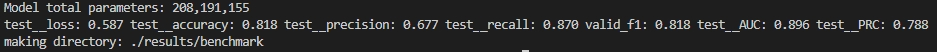

# :sparkles: SMRTnet :sparkles:

This is a [PyTorch](https://pytorch.org/) implementation of our paper:

## :page_facing_up: Predicting small molecule and RNA target interactions using deep neural network

<p align="justify" >
Small molecules can bind RNAs to regulate their fate and functions, providing promising opportunities for treating human diseases. However, current tools for predicting small molecule-RNA interactions (SRIs) require prior knowledge of RNA tertiary structures, limiting their utility in drug discovery. Here, we present SMRTnet, a deep learning method to predict SRIs based on RNA secondary structure. By integrating <b>two large language models</b>, <b>convolutional neural networks</b>, <b>graph attention networks</b>, and <b>multimodal data fusion</b>, SMRTnet achieves high performance across multiple experimental benchmarks, substantially outperforming existing state-of-the-art tools. 
</p>
<p align="justify" >
For wet-lab validation, we conducted a large-scale experimental assessment on SMRTnet predictions for 10 disease-associated RNA targets (including <b>mRNA of undruggable proteins, onco-miRNAs, viral RNAs, and RNA repeat expansions</b>), identifying 40 hits of RNA-targeting small molecules with nanomolar-to-micromolar dissociation constants using microscale thermophoresis (MST). Focusing on the <i>MYC</i> internal ribosome entry site (IRES) as a target, SMRTnet-predicted small molecules showed binding scores correlated closely with observed validation rates. Notably, one predicted compound downregulated <i>MYC</i> expression, inhibited proliferation, and promoted apoptosis in three cancer cell lines. 
</p>
<p align="justify" >
Taken together, SMRTnet expands the scope of feasible RNA targets and accelerates the discovery and development of RNA-targeting therapeutics.
</p>

<p align="center"></p>

## :round_pushpin: Cite us
<!--If you found this package useful, please cite [our paper](xxx)-->
If you found this package useful, please cite our paper (under revision):
```
Yuhan Fei, Pengfei Wang, Jiasheng Zhang, Xinyue Shan, Zilin Cai, Jianbo Ma, Yangming Wang, Qiangfeng Cliff Zhang,

Predicting small molecule and RNA target interactions using deep neural network, 2025.
```
## :telephone: Contact us
Please contact us if you are interested in our work and look for academic collaboration:  
- Dr. Yuhan Fei, School of Life Sciences, Tsinghua University, Posdoc, yuhan_fei@outlook.com  
- Jiasheng Zhang, School of Life Sciences, Tsinghua University, PhD student, zjs21@mails.tsinghua.edu.cn

## :speech_balloon: Table of contents
- [:one: Getting Started](#getting-started)
  - Install via PyPI
  - Run SMRTnet via Google Colab
- [:two: Download pre-trained models](#download-pre-trained-models-from-zenodo)
- [:three: Repo Structure](#repo-structure)
- [:four: Datasets](#datasets)
- [:five: Usage](#usage)
  - How to train your own model
  - How to test the performance of model
  - How to inference based on the SMRTnet model
  - How to benchmark based on known interactions
  - How to perform model interpretibility
- [:six: Referenced Repos](#referenced-repos)
- [:seven: Copyright and License](#copyright-and-license)
- [:eight: Patent](#patent)
- [:nine: Disclaimer](#disclaimer)

<!--  - How to check your input format -->
<!-- - [Example](#example)-->
<!-- - [6. Web Server (Coming soon...)](#web-server) -->

## Getting started

Please run the following command to check your CUDA version before installing SMRTnet:
```bash
nvidia-smi
```
 or 
 ```bash
nvcc --version
```
<!-- Note: All tests were conducted on a **Linux Ubuntu 13.x** operating system with CUDA versions **11.x and 12.x**.  -->

### :pushpin: Install via PyPI
**1) The Stable version for installation** (Recommend)
```bash
## pip install our packages online 
conda create -n smrtnet python=3.8.10
conda activate smrtnet
pip install torch==2.4.1+cu118 torchvision==0.19.1+cu118 torchaudio==2.4.1 --index-url https://download.pytorch.org/whl/cu118
pip install smrtnet
conda install dglteam/label/th24_cu118::dgl
```
**Note:** This installation method will be maintained periodically.

**2) The Latest version for installation** 
```bash
## pip install our packages online
conda create -n smrtnet python=x.x.x
conda activate smrtnet-latest
pip install torch==xxx torchvision==xxx torchaudio==xxx --index-url xxx
pip install smrtnet-latest
conda install dglteam/label/xxx
```
**Note:** This installation method will undergo frequent iterations.

:heavy_exclamation_mark: **Note:** Please visit https://pytorch.org/get-started/previous-versions/ to install the correct torch and the correponding [dgl-cuda](https://anaconda.org/dglteam/repo) according to your own CUDA version.  
Additionally, we have uploaded the entire SMRTnet environment to Zenodo (https://zenodo.org/records/14970392) as an alternative option.


### :pushpin: Run SMRTnet via Google Colab

We have developed an online jupyter-notebook that enables installation-free execution of SMRTnet in the web browser via Google Colab  (https://colab.research.google.com/drive/1pm5ZCD8cFRvPA9RPvtEaCHoU1p5X5v4Y?usp=sharing). This solution supports both inference and interpretability functionalities while eliminating system-specific installation issues with limited GPU resources. 


- **Step 1:** Please click the link (https://drive.google.com/drive/folders/1HQo3o2saY5U9vPqebz4ZdpCVVQXqw0q_?usp=sharing), then copy the shared folder to your own Google Drive by dragging it into your Drive interface:

<p align="center"></p>

<br>

- **Step 2:** Please follow the step-by-step instructions provided in the SMRTnet.ipynb notebook (https://colab.research.google.com/drive/1pm5ZCD8cFRvPA9RPvtEaCHoU1p5X5v4Y?usp=sharing) to run SMRTnet directly. <!--:heavy_exclamation_mark:-->

<p align="center"></p>

<br>
:bangbang:  If you encounter any issues during the installation process, please feel free to report the problem in the **Issues module** or contact us directly via **email** at yuhan_fei@outlook.com or zjs21@mails.tsinghua.edu.cn.


## Download pre-trained models from Zenodo

<p align="center"></p>
<!--
### :postbox: The details of each module

<details>
   <summary> Click here for architecture of RNA sequence encoder (RNA language model) </summary>
   <p align="center"></p>
</details>

<details>
   <summary> Click here for architecture of RNA structure encoder (convolution block) </summary>
   <p align="center"></p>
</details>

<details>
   <summary> Click here for architecture of small molecule SMILES encoder (Chemical language model) </summary>
   <p align="center"></p>
   Figure from the MoLFormer publication (https://www.nature.com/articles/s42256-022-00580-7). 
</details>

<details>
   <summary> Click here for architecture of small molecule structure encoder (Graph attention block)</summary>
   <p align="center"></p>
</details>

<details>
   <summary> Click here for architecture of multimodal data fusion module </summary>
   <p align="center"></p>
</details>
-->

<!--### :bangbang: Download our pre-trained models from zenodo （Required）-->

Since the pre-trained models used in SMRTnet are large, we have uploaded them to Zenodo for users to download directly. Users required to download the pre-trained models — including the RNA language model (RNASwan-seq), the chemical language model (MoLFormer), and the pre-trained SMRTnet model — from the link below and place them in the SMRTnet folder (see the Repo Structure section below for details).

:bangbang: Downloadable pre-trained models used in SMRTnet: https://zenodo.org/records/14715564

<p align="center"></p>
Alternatively, we also provided the command lines for users to download pre-trained models diirectly and put them into the SMRTnet directory:

```bash
# Step 1: Navigate to the SMRTnet directory:
cd ${your_directory}/SMRTnet

# Step 2: Download and unzip the pre-trained chemical language model (MoLFormer)
wget https://zenodo.org/records/14715564/files/LM_Mol.zip?download=1
unzip LM_Mol.zip

# Step 3: Download and unzip the pre-trained RNA language model (RNASwan-seq)
wget https://zenodo.org/records/14715564/files/LM_RNA.zip?download=1
unzip LM_RNA.zip

# Step 4:  Navigate to the results folder of SMRTnet directory, download and unzip the SMRTnet model
cd ${your_directory}/SMRTnet/results
wget https://zenodo.org/records/14715564/files/SMRTnet_model.zip?download=1
unzip SMRTnet_model.zip

```


## Repo Structure:
After downloading all our data, the repo has the following structure:


```bash
├── LM_Mol (download from zenodo)
|
├── LM_RNA (download from zenodo)
|
├── results
|   └── SMRTNet_model (download from zenodo)
|          └── SMRTnet_cv1.pth
|          └── SMRTnet_cv2.pth
|          └── SMRTnet_cv3.pth
|          └── SMRTnet_cv4.pth
|          └── SMRTnet_cv5.pth
|          └── config.pkl
|
├── data
|   └── SMRTnet-data-demo.txt
|   └── SMRTnet-benchmark-demo.txt
|   └── MYC_RIBOTAC.txt
|   └── MYC_IRES.txt
|
├── dataset_cv_best
|
├── img_log
|
├── README.md
├── LISENCE
├── explain.py
├── infer.py
├── interpret.ipynb
├── loader.py
├── loop.py
├── main.py
├── model.py
├── requirements.txt
├── utils.py
└── visual.py
```

<!--
## Datasets

### :pushpin: Datasets for training

The training data for SMRTnet is available in the data folder: `SMRTnet-data.txt`

The data of SMRTnet is sourced from https://www.rcsb.org/  
The raw PDB structural data used in SMRTnet can be downloaded from https://zenodo.org/records/14986116

The processed format of SMRTnet-data for training is show as follow:

| SMILES | Sequence | Structure | label |
|-----------------|-------------|-------------|-------------|
| CC1=CC2=C(CC1)C(=CC3=C2C(=CO3)C)C | GGGGGGGCUUCGCCUCUGGCCCAGCCCUCCC | (((((((((..(((...)))..))))))))) | 1 |
| CC1=CC(=O)OC2=C1C=CC(=C2)O | GAUGUUGACUGUUGAAUCUCAUGGCAACACC | (.(((((.((((.(.....)))))))))).) | 0 | 


### :pushpin: Format of input RNA target for inference:

The length of RNA should >=31nt, and the sequence length should equal to the structure length. Data are split by tab and ignore the first header row.  


| RNA  | Sequence | Structure |
|-----------------|-------------|-------------|
| MYC_IRES | GUGGGGGCUUCGCCUCUGGCCCAGCCCUCAC | (((((((((..(((...)))..))))))))) |


### :pushpin: Format of input small molecule  for inference:
The SMILES of small molecule should meet the requirement of RDkit. Data are split by tab and ignore the first header row.

| CAS | SMILES |
|-----------------|-------------|
| 3902-71-4 | CC1=CC(=O)OC2=C1C=C3C=C(OC3=C2C)C |
| 149-91-7 | C1=C(C=C(C(=C1O)O)O)C(=O)O |
| 132201-33-3 | C1=CC=C(C=C1)C(C(C(=O)O)O)NC(=O)C2=CC=CC=C2 | 
| ... | ... | 

### :pushpin: RNA sequence datasets for RNA language model (RNASwan-seq)

The dataset used for RNA language model was compiled from 7 sources: the European Nucleotide Archive, NCBI's nucleotide database, GenBank, Ensembl, RNAcentral, CSCD2, and GreeNC 2.0, encompassing a total of **470 million** RNA sequences. We de-duplicated with 100% sequence similarity using MMSeqs2, resulting in about **214 million** unique RNA sequences


### :pushpin: SMILES datasets for chemical language model (MoLFormer)

Datasets are available at https://ibm.box.com/v/MoLFormer-data

More details can be found in https://github.com/IBM/molformer
-->

## Datasets

### :pushpin: Datasets for training and test:

The training data for SMRTnet is available in the data folder: `SMRTnet_data.txt`

The data of SMRTnet is sourced from https://www.rcsb.org/  
The raw PDB structural data used in SMRTnet can be downloaded from https://zenodo.org/records/14986116

The format of data for training is show as follow, the length of RNA sequence and its structure is 31-nt:

| SMILES | Sequence | Structure | label |
|-----------------|-------------|-------------|-------------|
| CC1=CC2=C(CC1)C(=CC3=C2C(=CO3)C)C | GGGGGGGCUUCGCCUCUGGCCCAGCCCUCCC | (((((((((..(((...)))..))))))))) | 1 |
| CC1=CC(=O)OC2=C1C=CC(=C2)O | GAUGUUGACUGUUGAAUCUCAUGGCAACACC | (.(((((.((((.(.....)))))))))).) | 0 | 
| ... | ... | ... | ... | 

Users can use do_train or do_test to run the data. 


### :pushpin: Datasets for inference:
The benchmark datasets for SMRTnet is available in the data folder: `MYC_IRES.txt` and `MYC_RIBOTAC.txt`

The length of RNA should ≥31nt, and the sequence length should equal to the structure length. Data are split by tab and ignore the first header row.  

| RNA  | Sequence | Structure |
|-----------------|-------------|-------------|
| MYC_IRES | GUGGGGGCUUCGCCUCUGGCCCAGCCCUCAC | (((((((((..(((...)))..))))))))) |


The SMILES of small molecule should meet the requirement of RDkit.Data are split by tab and ignore the first header row.  

| CAS | SMILES |
|-----------------|-------------|
| 3902-71-4 | CC1=CC(=O)OC2=C1C=C3C=C(OC3=C2C)C |
| 149-91-7 | C1=C(C=C(C(=C1O)O)O)C(=O)O |
| 132201-33-3 | C1=CC=C(C=C1)C(C(C(=O)O)O)NC(=O)C2=CC=CC=C2 | 
| ... | ... | 

Users can use do_ensemble or do_infer to run the data. 


### :pushpin: Datasets for benchmarking:

The benchmark datasets for SMRTnet is available in the data folder: `SMRTnet_benchmark.txt`

The SMRTnet-benchmark is sourced from 5 experimental validated external datasets:
1) R-BIND (https://rbind.chem.duke.edu/)
2) R-SIM (https://web.iitm.ac.in/bioinfo2/R_SIM/)
3) SMMRNA (http://www.smmrna.org/)
4) NALDB (http://bsbe.iiti.ac.in/bsbe/naldb/HOME.php)
5) NewPub (https://pubmed.ncbi.nlm.nih.gov/)

<!--The raw PDB structural data used in SMRTnet can be downloaded from https://zenodo.org/records/14986116-->

The format of data for benchmarking is show as follow, the length of RNA sequence and its structure should ≥31-nt :

| SMILES | Sequence | Structure | label |
|-----------------|-------------|-------------|-------------|
| C1=NC2=NC(=NC(=C2N1)N)N | GGACAUAUAAUCGCGUGGAUAUGGCACGCAAGUUUCUACCGGGCACCGUAAAUGUCCGAUUAUGUCC | (((((((((..(((...)))..))))))))) | 1 |
| c12c(ncnc1N)[nH]cn2 | GGACAUAUAAUCGCGUGGAUAUGGCACGCAAGUUUCUACCGGGCACCGUAAAUGUCCGAUUAUGUCC | (.(((((.((((.(.....)))))))))).) | 0 | 
| ... | ... | ... | ... | 

Users can use do_benchmark or do_test to run the data. 


## Usage

- The training of SMRTnet requires **~14G** of GPU memory (with batch_size = 32) and takes **~48 hours** to complete training using the SMRTnet-data dataset with 5-fold corss-validation.
- The inference of SMRTnet requires **~4G** of GPU memory (with batch_size = 1) and takes **~25 seconds** to predict binding score of a small molecule-RNA pair using the ensemble scoring strategy on a single GPU.

<!--
### Check your input data format

Check input format
```
python main.py --do_check
```
-->

### :hearts: Training 


<!-- where you replace `in_dir` with the directory of the data file you want to use, you will load your own data for the training. Hyper-parameters could be tuned in xxx. For available training options, please take a look at `main.py --help`. To monitor the training process, add option `--tfboard` in `main.py`, and view page at http://localhost:6006 using tensorboard -->

You can run the training using:  
```
python main.py --do_train
```

We provide the example scripts to train the model from scratch:

```python
python main.py --do_train \
               --data_dir=./data/SMRTnet_data.txt \
               --cuda 0 \
               --batch_size 32 \
               --out_dir=./results/demo \
               --lm_rna_config ./LM_RNA/parameters.json \
	       --lm_rna_model ./LM_RNA/model_state_dict/rnaall_img0_min30_lr5e5_bs30_2w_7136294_norm1_05_1025_150M_16_rope_fa2_noropeflash_eps1e6_aucgave_1213/epoch_0/LMmodel.pt \
	       --lm_mol_config ./LM_Mol/bert_vocab.txt  \
	       --lm_mol_model ./LM_Mol/pretrained/checkpoints/N-Step-Checkpoint_3_30000.ckpt
```
<p align="center"></p>  

### :spades: Evaluation
You can run the evaluation using: 
```
python main.py --do_test
```
We provide the example scripts to test the model:

```python
DIR=./results/SMRTnet_model

python main.py --do_test \
               --data_dir=./data/SMRTnet_data_test.txt \
               --infer_config_dir ${DIR}/config.pkl \
               --infer_model_dir ${DIR}/SMRTnet_cv1.pth \
               --cuda 0 \
               --batch_size 16 \
               --out_dir=./results/benchmark \
               --lm_rna_config ./LM_RNA/parameters.json \
	       --lm_rna_model ./LM_RNA/model_state_dict/rnaall_img0_min30_lr5e5_bs30_2w_7136294_norm1_05_1025_150M_16_rope_fa2_noropeflash_eps1e6_aucgave_1213/epoch_0/LMmodel.pt \
	       --lm_mol_config ./LM_Mol/bert_vocab.txt  \
	       --lm_mol_model ./LM_Mol/pretrained/checkpoints/N-Step-Checkpoint_3_30000.ckpt
```
Note: This case represents the results of the model from the 1-fold CV (SMRTnet_cv1.pth).  
SMRTnet uses an ensemble scoring strategy to make prediction based on the 5 models from 5-fold cross-validation, the infer_model_dir parameter needs to be modified to SMRTnet_cv2.pth, SMRTnet_cv3.pth, SMRTnet_cv4.pth, and SMRTnet_cv5.pth, respectively.

<p align="center"></p>  


### :diamonds: Inference
SMRTnet uses an ensemble scoring strategy to make prediction based on the 5 models from 5-fold cross-validation
<p align="center"></p>  

You can perform inference using two approaches, including {do_ensemble} and {do_infer}. The difference between them lies in whether multiple GPUs are used.    
<!--
For a single GPU inference:
```
python main.py --do_ensemble
```
For multiple GPUs inference:
```
python main.py --do_infer   
```
-->

- 1)  <b>The ensemble scoring strategy</b>: We provide the example scripts to perform inference with a single GPU:
```python
DIR=./results/SMRTnet_model

cd ${WorkDir}

python main.py --do_ensemble --cuda 0 \
               --infer_config_dir ${DIR}/config.pkl \
               --infer_model_dir ${DIR} \
               --infer_out_dir ./data/ensemble \
               --infer_rna_dir ${INPUTPATH}/data/MYC_IRES.txt \
               --infer_drug_dir ${INPUTPATH}/data/MYC_RIBOTAC.txt \
               --lm_rna_config ./LM_RNA/parameters.json \
	       --lm_rna_model ./LM_RNA/model_state_dict/rnaall_img0_min30_lr5e5_bs30_2w_7136294_norm1_05_1025_150M_16_rope_fa2_noropeflash_eps1e6_aucgave_1213/epoch_0/LMmodel.pt \
	       --lm_mol_config ./LM_Mol/bert_vocab.txt  \
	       --lm_mol_model ./LM_Mol/pretrained/checkpoints/N-Step-Checkpoint_3_30000.ckpt
```
<p align="center"></p>  

- 2) <b>The parallel ensemble scoring strategy</b>: We also provide the example scripts to accelerate inference with multipe GPUs simultaneously:

```python
DIR=./results/SMRTnet_model

cd ${WorkDir}

#1. Run 1-fold CV model on No.1 of GPU
CV=1
mkdir -p ./results/MYC_with_RiboTac/CV_1
python main.py --do_infer --cuda 1 \
    --infer_config_dir ${DIR}/config.pkl \
    --infer_model_dir ${DIR}/SMRTnet_cv1.pth \
    --infer_out_dir ./results/MYC_with_RiboTac/CV_1/results.txt \
    --infer_rna_dir ${INPUTPATH}/data/MYC_IRES.txt \
    --infer_drug_dir ${INPUTPATH}/data/MYC_RIBOTAC.txt \
    --lm_rna_config ./LM_RNA/parameters.json \
    --lm_rna_model ./LM_RNA/model_state_dict/rnaall_img0_min30_lr5e5_bs30_2w_7136294_norm1_05_1025_150M_16_rope_fa2_noropeflash_eps1e6_aucgave_1213/epoch_0/LMmodel.pt \
    --lm_mol_config ./LM_Mol/bert_vocab.txt  \
    --lm_mol_model ./LM_Mol/pretrained/checkpoints/N-Step-Checkpoint_3_30000.ckpt

#2. Run 2-fold CV model on No.2 of GPU
CV=2
mkdir -p ./results/MYC_with_RiboTac/CV_2
python main.py --do_infer --cuda 2 \
    --infer_config_dir ${DIR}/config.pkl \
    --infer_model_dir ${DIR}/SMRTnet_cv2.pth \
    --infer_out_dir ./results/MYC_with_RiboTac/CV_2/results.txt \
    --infer_rna_dir ${INPUTPATH}/data/MYC_IRES.txt \
    --infer_drug_dir ${INPUTPATH}/data/MYC_RIBOTAC.txt \
    --lm_rna_config ./LM_RNA/parameters.json \
    --lm_rna_model ./LM_RNA/model_state_dict/rnaall_img0_min30_lr5e5_bs30_2w_7136294_norm1_05_1025_150M_16_rope_fa2_noropeflash_eps1e6_aucgave_1213/epoch_0/LMmodel.pt \
    --lm_mol_config ./LM_Mol/bert_vocab.txt  \
    --lm_mol_model ./LM_Mol/pretrained/checkpoints/N-Step-Checkpoint_3_30000.ckpt

#3. Run 3-fold CV model on No.3 of GPU
CV=3
mkdir -p ./results/MYC_with_RiboTac/CV_3
python main.py --do_infer --cuda 3 \
    --infer_config_dir ${DIR}/config.pkl \
    --infer_model_dir ${DIR}/SMRTnet_cv3.pth \
    --infer_out_dir ./results/MYC_with_RiboTac/CV_3/results.txt \
    --infer_rna_dir ${INPUTPATH}/data/MYC_IRES.txt \
    --infer_drug_dir ${INPUTPATH}/data/MYC_RIBOTAC.txt \
    --lm_rna_config ./LM_RNA/parameters.json \
    --lm_rna_model ./LM_RNA/model_state_dict/rnaall_img0_min30_lr5e5_bs30_2w_7136294_norm1_05_1025_150M_16_rope_fa2_noropeflash_eps1e6_aucgave_1213/epoch_0/LMmodel.pt \
    --lm_mol_config ./LM_Mol/bert_vocab.txt  \
    --lm_mol_model ./LM_Mol/pretrained/checkpoints/N-Step-Checkpoint_3_30000.ckpt

#4. Run 4-fold CV model on No.4 of GPU
CV=4
mkdir -p ./results/MYC_with_RiboTac/CV_4
python main.py --do_infer --cuda 4 \
    --infer_config_dir ${DIR}/config.pkl \
    --infer_model_dir ${DIR}/SMRTnet_cv4.pth \
    --infer_out_dir ./results/MYC_with_RiboTac/CV_4/results.txt \
    --infer_rna_dir ${INPUTPATH}/data/MYC_IRES.txt \
    --infer_drug_dir ${INPUTPATH}/data/MYC_RIBOTAC.txt \
    --lm_rna_config ./LM_RNA/parameters.json \
    --lm_rna_model ./LM_RNA/model_state_dict/rnaall_img0_min30_lr5e5_bs30_2w_7136294_norm1_05_1025_150M_16_rope_fa2_noropeflash_eps1e6_aucgave_1213/epoch_0/LMmodel.pt \
    --lm_mol_config ./LM_Mol/bert_vocab.txt  \
    --lm_mol_model ./LM_Mol/pretrained/checkpoints/N-Step-Checkpoint_3_30000.ckpt

#5. Run 5-fold CV model on No.5 of GPU
CV=5
mkdir -p ./results/MYC_with_RiboTac/CV_5
python main.py --do_infer --cuda 5 \
    --infer_config_dir ${DIR}/config.pkl \
    --infer_model_dir ${DIR}/SMRTnet_cv5.pth \
    --infer_out_dir ./results/MYC_with_RiboTac/CV_5/results.txt \
    --infer_rna_dir ${INPUTPATH}/data/MYC_IRES.txt \
    --infer_drug_dir ${INPUTPATH}/data/MYC_RIBOTAC.txt \
    --lm_rna_config ./LM_RNA/parameters.json \
    --lm_rna_model ./LM_RNA/model_state_dict/rnaall_img0_min30_lr5e5_bs30_2w_7136294_norm1_05_1025_150M_16_rope_fa2_noropeflash_eps1e6_aucgave_1213/epoch_0/LMmodel.pt \
    --lm_mol_config ./LM_Mol/bert_vocab.txt  \
    --lm_mol_model ./LM_Mol/pretrained/checkpoints/N-Step-Checkpoint_3_30000.ckpt

#6. Their outputs are combined by median to produce the final binding score

python mergeCV.py --data_dir ./results/MYC_with_RiboTac --results_name results


```


### :clubs: Benchmarking

SMRTnet uses an ensemble scoring strategy to benchmark known interaction/non-interaction based on the 5 models from 5-fold cross-validation

```python
DIR=./results/SMRTnet_model

cd ${WorkDir}

python main.py --do_benchmark --cuda 0 \
               --infer_config_dir ${DIR}/config.pkl \
               --infer_model_dir ${DIR} \
               --infer_out_dir ./data/benchmark \
               --infer__dir ${INPUTPATH}/data/SMRTnet_benchmark.txt \
               --lm_rna_config ./LM_RNA/parameters.json \
	           --lm_rna_model ./LM_RNA/model_state_dict/rnaall_img0_min30_lr5e5_bs30_2w_7136294_norm1_05_1025_150M_16_rope_fa2_noropeflash_eps1e6_aucgave_1213/epoch_0/LMmodel.pt \
	       --lm_mol_config ./LM_Mol/bert_vocab.txt  \
	       --lm_mol_model ./LM_Mol/pretrained/checkpoints/N-Step-Checkpoint_3_30000.ckpt
```


### :gem: Interpretability
For computing high attention regions using the trained models, You can run it using the following scripts and visualize the results in jupyter-notebook
```
python main.py --do_explain
```
We provide the example scripts to perform interpretability of model:

```python
DIR=./results/SMRTnet_model

cd ${WorkDir}

python main.py --do_explain --cuda 0 \
    --infer_config_dir ${DIR}/config.pkl \
    --infer_model_dir ${DIR} \
    --infer_out_dir ./results/MYC --infer_rna_dir ${INPUTPATH}/data/MYC_IRES.txt \
    --infer_drug_dir ${INPUTPATH}/data/MYC_RIBOTAC.txt --smooth_steps 3 \
    --lm_rna_config ./LM_RNA/parameters.json \
    --lm_rna_model ./LM_RNA/model_state_dict/rnaall_img0_min30_lr5e5_bs30_2w_7136294_norm1_05_1025_150M_16_rope_fa2_noropeflash_eps1e6_aucgave_1213/epoch_0/LMmodel.pt \
    --lm_mol_config ./LM_Mol/bert_vocab.txt  \
    --lm_mol_model ./LM_Mol/pretrained/checkpoints/N-Step-Checkpoint_3_30000.ckpt
```
You can run [interpret.ipynb](./interpret.ipynb) after executing the command above to plot the binding site results as below:

<p align="center"></p>  


<!--
## Example

### Case Study 1: Inference: N small molecules vs N RNA target:

<details>
   <summary>Click here for the code!</summary>

```python
DIR=./results/SMRTnet_model

cd ${WorkDir}

python main.py --do_ensemble --cuda 0 --infer_config_dir ${DIR}/config.pkl --infer_model_dir ${DIR} --infer_out_dir ./results/ensemble --infer_rna_dir ${INPUTPATH}/data/rna.txt --infer_drug_dir ${INPUTPATH}/data/drug.txt

```

or 

```python
CV=1
nohup python main.py --do_infer --cuda 0 \
    --infer_config_dir ${DIR}/config.pkl --infer_model_dir ${DIR}/model_CV_${CV}_best.pth \
    --infer_out_dir ./results/screenDrug/results_all_screen_${CV}_DL.txt \
	--infer_rna_dir ${INPUTPATH}/dataset/experiment_6_target.txt \
    --infer_drug_dir ${INPUTPATH}/dataset/all_databaseI_drug_iso.txt &

CV=2
nohup python main.py --do_infer --cuda 1 \
    --infer_config_dir ${DIR}/config.pkl --infer_model_dir ${DIR}/model_CV_${CV}_best.pth \
    --infer_out_dir ./results/screenDrug/results_all_screen_${CV}_DL.txt \
	--infer_rna_dir ${INPUTPATH}/dataset/experiment_6_target.txt \
    --infer_drug_dir ${INPUTPATH}/dataset/all_databaseI_drug_iso.txt &

CV=3
nohup python main.py --do_infer --cuda 2 \
    --infer_config_dir ${DIR}/config.pkl --infer_model_dir ${DIR}/model_CV_${CV}_best.pth \
    --infer_out_dir ./results/screenDrug/results_all_screen_${CV}_DL.txt \
	--infer_rna_dir ${INPUTPATH}/dataset/experiment_6_target.txt \
    --infer_drug_dir ${INPUTPATH}/dataset/all_databaseI_drug_iso.txt &

CV=4
nohup python main.py --do_infer --cuda 3 \
    --infer_config_dir ${DIR}/config.pkl --infer_model_dir ${DIR}/model_CV_${CV}_best.pth \
    --infer_out_dir ./results/screenDrug/results_all_screen_${CV}_DL.txt \
	--infer_rna_dir ${INPUTPATH}/dataset/experiment_6_target.txt \
    --infer_drug_dir ${INPUTPATH}/dataset/all_databaseI_drug_iso.txt &

CV=5
nohup python main.py --do_infer --cuda 4 \
    --infer_config_dir ${DIR}/config.pkl --infer_model_dir ${DIR}/model_CV_${CV}_best.pth \
    --infer_out_dir ./results/screenDrug/results_all_screen_${CV}_DL.txt \
	--infer_rna_dir ${INPUTPATH}/dataset/experiment_6_target.txt \
    --infer_drug_dir ${INPUTPATH}/dataset/all_databaseI_drug_iso.txt &

```

</details>


### Case Study 2: Benchmarking: benchmark evalutation:

<details>
   <summary>Click here for the code!</summary>

```python
DIR=./results/20231229_lbncab4_v3_allrna_ep100_bs32_lr00001_linear_simple_drug_cls_1024_1024_1024_512_CV5_4_fix

cd ${WorkDir}

python main.py --do_benchmark --cuda 0 --data_dir ${INPUTPATH}/demo/ours_v3.txt --infer_config_dir ${DIR}/config.pkl --infer_model_dir ${DIR} --infer_out_dir ./results/benchmark

```
</details>

### Case Study 3: transcript-wide analysis (RNA targets more than 31nt)

<details>
   <summary>Click here for the code!</summary>

```python

  python main.py --do_ensemble

```
</details>


### Case Study 4: Binding site prediction:

<details>
   <summary>Click here for the code!</summary>

```python
DIR=./results/20231229_lbncab4_v3_allrna_ep100_bs32_lr00001_linear_simple_drug_cls_1024_1024_1024_512_CV5_4_fix

cd ${WorkDir}

python main.py --do_explain --cuda 0 --infer_config_dir ${DIR}/config.pkl --infer_model_dir ${DIR} \
    --infer_out_dir ./results/MYC --infer_rna_dir ${INPUTPATH}/data/rna.txt \
    --infer_drug_dir ${INPUTPATH}/data/drug.txt --smooth_steps 3

```
</details>

### Case Study 5: Key functional group prediction

<details>
   <summary>Click here for the code!</summary>

```python
DIR=./results/20231229_lbncab4_v3_allrna_ep100_bs32_lr00001_linear_simple_drug_cls_1024_1024_1024_512_CV5_4_fix

cd ${WorkDir}
python main.py --do_explain --cuda 0 --infer_config_dir ${DIR}/config.pkl --infer_model_dir ${DIR} \
    --infer_out_dir ./results/MYC --infer_rna_dir ${INPUTPATH}/data/rna.txt \
    --infer_drug_dir ${INPUTPATH}/data/drug.txt --smooth_steps 3

```
</details>


### Case Study 6: Fragment-based design

<details>
   <summary>Click here for the code!</summary>

```python
DIR=./results/20231229_lbncab4_v3_allrna_ep100_bs32_lr00001_linear_simple_drug_cls_1024_1024_1024_512_CV5_4_fix

cd ${WorkDir}
python main.py --do_delta --cuda 0 --infer_config_dir ${DIR}/config.pkl --infer_model_dir ${DIR} --infer_out_dir ./results/delta --infer_rna_dir ${INPUTPATH}/data/rna2.txt --infer_drug_dir ${INPUTPATH}/data/drug.txt

Draw linkers for small molecule using [OPENBABEL](https://www.cheminfo.org/Chemistry/Cheminformatics/FormatConverter/index.html)
```
</details>
-->

<!--
## Web Server
We also provide a website [http://smrtnet.zhanglab.net/](http://101.6.120.41:9990/drug/) to predict and visualize the interactions between small molecule and RNA.
<p align="center"></p>
-->
<!--
## Referenced Repos
1. [MoLFormer](https://github.com/IBM/molformer)
2. CNN: [LeNet](https://doi.org/10.1109/5.726791) and [AlexNet](https://doi.org/10.1145/3065386)
3. [ResNet](https://doi.org/10.48550/arXiv.1512.03385)
4. [GAT](https://doi.org/10.48550/arXiv.1710.10903)
5. [Transformer](https://doi.org/10.48550/arXiv.1706.03762)
6. [OPENBABEL](https://github.com/openbabel/openbabel) and [its web](https://www.cheminfo.org/Chemistry/Cheminformatics/FormatConverter/index.html)
7. [DSSR](http://home.x3dna.org/)
-->
## Referenced Repos
1. MoLFormer: [https://github.com/IBM/molformer](https://github.com/IBM/molformer)
2. Convolutional neural networks: [LeNet](https://doi.org/10.1109/5.726791) and [AlexNet](https://doi.org/10.1145/3065386)
3. Residual neutral networks: [https://doi.org/10.48550/arXiv.1512.03385](https://doi.org/10.48550/arXiv.1512.03385)
4. Graph Attention networks: [https://github.com/awslabs/dgl-lifesci](https://github.com/awslabs/dgl-lifesci)
5. Transformer: [https://doi.org/10.48550/arXiv.1706.03762](https://doi.org/10.48550/arXiv.1706.03762)
6. OPENBABEL: [https://github.com/openbabel/openbabel](https://github.com/openbabel/openbabel) and [web server](https://www.cheminfo.org/Chemistry/Cheminformatics/FormatConverter/index.html)
7. atomium: [https://github.com/samirelanduk/atomium](https://github.com/samirelanduk/atomium)
8. DSSR: [http://home.x3dna.org/](http://home.x3dna.org/)

## Copyright and License
This project is free to use for non-commercial purposes - see the [LICENSE](LICENSE) file for details.

## Patent
Patent Name：小分子和RNA互作关系的预测方法、系统、存储介质和设备  
Inventors：张强锋 (Qiangfeng Cliff Zhang)、费宇涵 (Yuhan Fei)、张佳胜 (Jiasheng Zhang)  
Publication Number：CN120199320A  
Publication Date：2025-06-24  
Related URL：https://m.tianyancha.com/zhuanli/51f993cb151b132315faa8d150a6a981  

## Disclaimer
The prediction of SMRTnet should be inspected manually by experts before proceeding to the wet-lab validation, and our work is still in active developement with limitations, please do not directly use the drugs.
